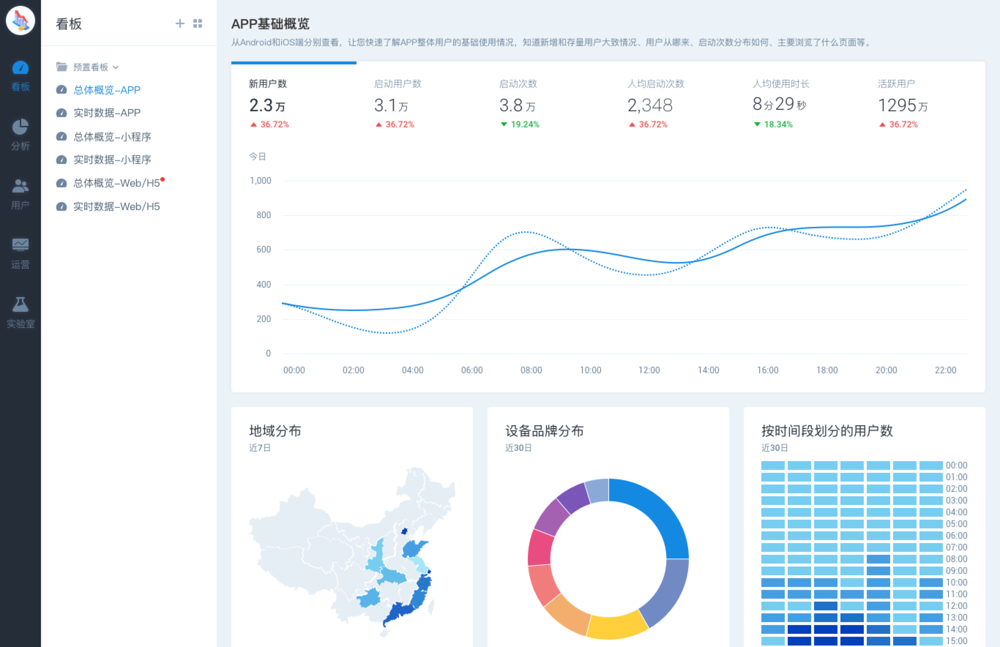

# 易观 Argo

我们最初推出 Argo 是希望有一种全新的产品体验——让大家在使用到商业级产品能力的时候尽量不用去考虑成本。虽然现在难以做到完全开源，但我们也会努力将商业级的产品通过社区带给更多人。

我们觉得数据驱动是一种基础能力，大家都应该更自由地使用。数据驱动在未来会有更广阔的应用场景，而目前在企业中的使用率还达不到普及。从长远来看，降低使用门槛的做法对提升普及率有积极意义。

也希望能在很快的未来，我们会和更多的开发者和社区爱好者一起，带动更多的朋友一起来做这件有意义的事情。

最新版：[4.3.4](http://arkinstall.analysys.cn/) 

**What's New in 4.3.4**
 - 现在可以通过 API 查询包括人群、事件分析、留存分析、转化漏斗及元数据等数据了
 - 更多更新内容在[这里](https://docs.analysys.cn/ark/release-notes)查看

## 为什么你需要 Argo ？

目前市面上能做用户行为数据收集和分析的产品很多，有的例如 Google Analytics、百度统计和友盟能基础数据统计和分析（当然 GA 能做更多事情只不过也需要更多的学习成本）。这类工具提供相似的指标分析体系，入门相对简单，可如果你需要数据做更多事情时也会发现他们无法满足。常见的场景有：

- 创建自定义的指标
- 将同一产品不同客户端的用户数据汇总分析
- 将数据明细导出到别的平台使用
- 基于实时数据驱动其它过程
- 管理用户分群并导出到其它平台使用
- 数据私有化而不是存在它们那里
- 更多他们不没有的分析模型

来自用户的数据是未来企业日常工作中会用到的基本元素，我们提倡“**早收集，自己存，存明细，分析快，导出易**”。如果你现在还在考虑用户行为相关的数据产品，可以先花几分钟部署 Argo 试一下。相信会给你的决策提供帮助。

## 他们已经在用

## Argo 提供的功能

### 分析类

* [渠道分析](https://docs.analysys.cn/ark/features/analytics/channel)
* [事件分析](https://docs.analysys.cn/ark/features/analytics/event)
* [会话分析](https://docs.analysys.cn/ark/features/analytics/session)
* [漏斗转化](https://docs.analysys.cn/ark/features/analytics/funnel)
* [留存分析](https://docs.analysys.cn/ark/features/analytics/retention)
* [智能路径](https://docs.analysys.cn/ark/features/analytics/pathfinder)
* [热图分析](https://docs.analysys.cn/ark/features/analytics/heatmap)
* [分布分析](https://docs.analysys.cn/ark/features/analytics/fen-bu-fen-xi)
* [间隔分析](https://docs.analysys.cn/ark/features/analytics/jian-ge-fen-xi)
* [属性分析](https://docs.analysys.cn/ark/features/analytics/shu-xing-fen-xi)
* [SQL查询](https://docs.analysys.cn/ark/features/analytics/sql)

### 用户类

* [用户群管理](https://docs.analysys.cn/ark/features/segmentation/profile)
* [用户行为轨迹](https://docs.analysys.cn/ark/features/segmentation/user-sequence)

### 动作类

* [发送系统通知](https://docs.analysys.cn/ark/features/operation/pushmessage)（极光、个推、百度、小米、华为）
* [发送电子邮件](https://docs.analysys.cn/ark/features/operation/email)（SendCloud）
* [发送短息](https://docs.analysys.cn/ark/features/operation/sms)（腾讯云短信、云集、领驭、乐信通）
* [广告活动管理](https://docs.analysys.cn/ark/features/operation/utm)（UTM、APP扫码）

## 问题反馈

* 提交[新功能需求](https://github.com/analysys/argo-installer/issues/new)
* 为[热门需求](https://github.com/analysys/argo-installer/issues?q=is%3Aopen+is%3Aissue+label%3A%22feature+request%22+sort%3Areactions-%2B1-desc)投票

# 安装说明

- [通过脚本安装](INSTALL_SCRIPT.md)（推荐！）
- [通过 Docker 安装](INSTALL_DOCKER.md)

# 常见问题

完成了后续安装步骤就正式进入了易观方舟Argo的探索之旅，下面是一些快速开始的文档：

- [接入前准备](https://ark.analysys.cn/docs/integration-prepare.html)
- [SDK指南](https://ark.analysys.cn/docs/sdk.html)
- [功能介绍](https://ark.analysys.cn/docs/function.html)
- [其它问题](https://ark.analysys.cn/docs/faq.html)

# 热切地寻找志同道合的小伙伴

正如你所见，我们希望通过易观 Argo 能让更多的早期团队也具备商业级用户行为驱动的能力。我们通过社区的方式来运营此版本，就是希望 Argo 能是社会的，而不是私有的。如果你认同我们的做法，并且也想贡献一份力量，无论你是否在易观，都有可以成为 Argo 社区的一员。

我们现在急需以下小伙伴：
1. 社群运营（社区贡献者或易观工作机会）
2. 大前端架构师（易观工作机会）

我们长期欢迎下面的小伙伴勾搭：
1. 产品经理（易观工作机会）
2. 产品设计师（易观工作机会）

有想法的小伙伴可以给 zhangxiaoliang@analysys.com.cn 发送邮件，或者通过任何方式联系到 Argo 同学，并注明来意。

期待与你共建用户行为分析以及基于用户行为驱动更多业务的社区！

# 社群

希望我们的努力可以解放更多人的生产力，祝你使用顺利！

官方论坛 https://geek.analysys.cn
